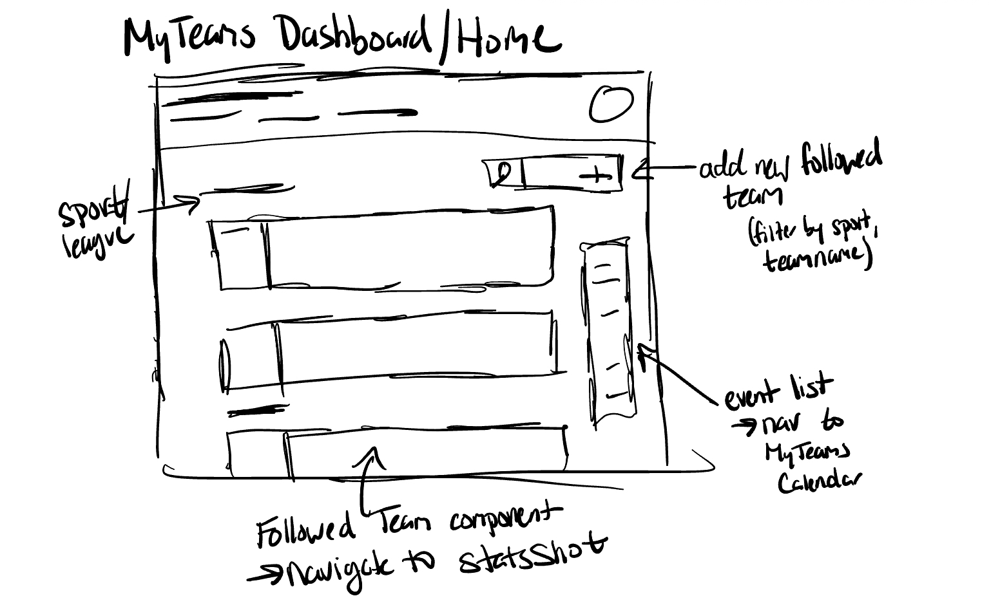
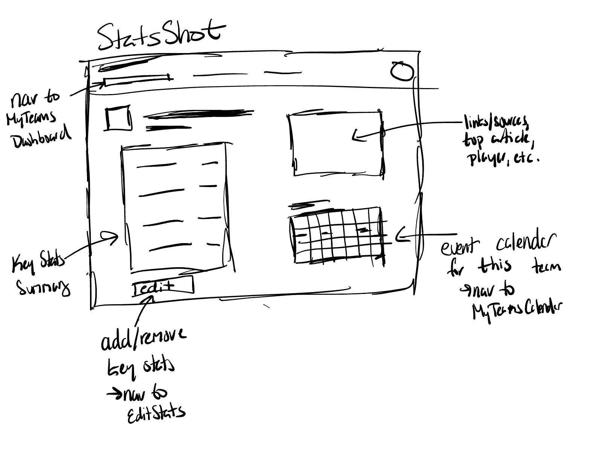
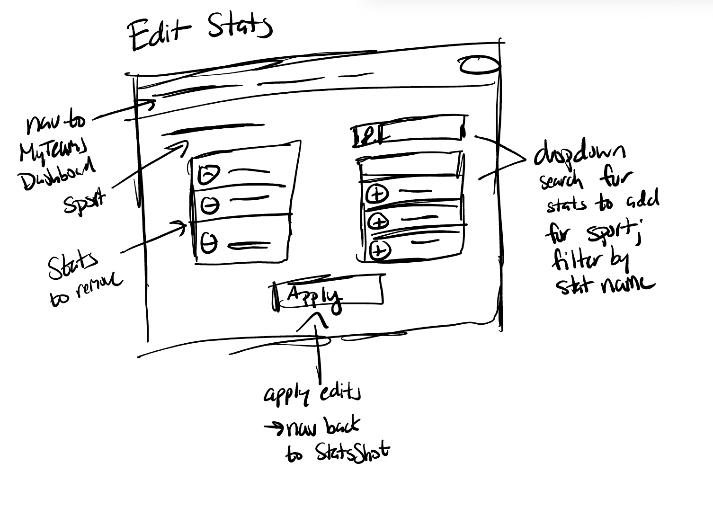
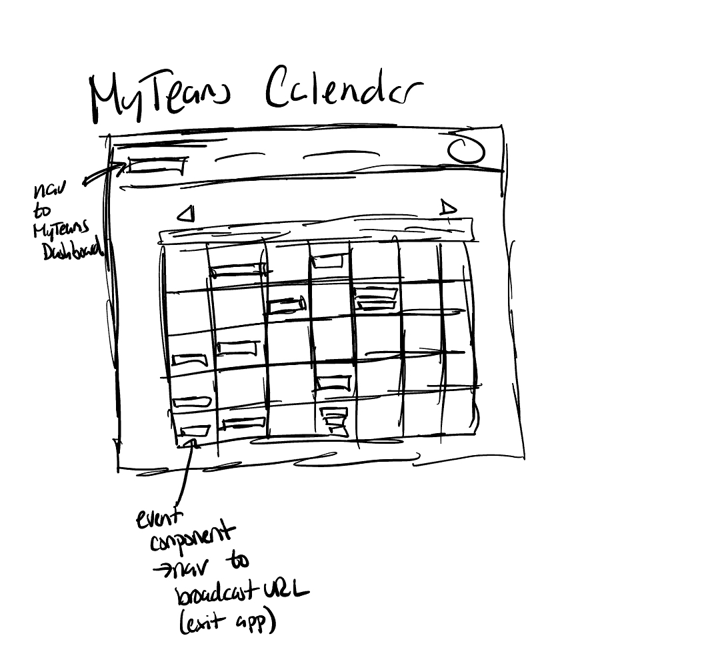

# Assignment 2
## Problem Statement
### Problem Domain: Tracking Sports Statistics
**tl;dr:** following games, scores, team/player stats, and player updates  
**Description**  
I follow teams across multiple leagues and cities, including the Ravens and Eagles (NFL), Phillies (MLB), and occasionally the Sixers (NBA) and Flyers (NHL). Also, as a swimmer, I like to know general news about the sport and major meets. I enjoy tracking stats, watching games, and staying up to date on scores, news, and player updates. I currently use a mix of apps to do so.

### The Problem: Multi-League fans struggle to keep track of their teams
**Description**  
Fans who follow teams across different leagues (ex. NFL + MLB) face the challenge of fragmented schedules and stats. With each league operating independently and most apps overwhelming users with excess content, it is difficult for multi-league fans to get a clear, unified view of the information that matters most to them

### Stakeholders:
**Multi-League Fans**  
Primary users who want to follow multiple teams across different leagues. They directly experience the current fragmentation and multitude sources to stay informed.

**Sports Leagues and Teams**  
Organizations (NFL, NBA, MLB, individual franchises) that generate the schedules, stats, and media. They are the originators of the fragmented information fans have to piece together.

**Sports Media Companies**  
Platforms like ESPN, Bleacher Report, and The Athletic aggregate scores and stats across leagues, but their content is often bundled with articles, ads, and notifications. In the context of the problem, they are both a source of essential information for fans and a contributor to information overload that makes it harder for users to quickly track what matters most.

**Fantasy and betting platforms** 
Companies like DraftKings or FanDuel rely on timely, cross-sport information for their users. Fragmentation of data makes it harder for these users to track stats and results efficiently, which can impact engagement.

**Casual/New Fans** 
Friends or newcomers who are less invested but want to follow teams when their group does. Scattered information makes it harder for them to join conversations and learn how to follow sports, while easier access could help them get engaged more quickly.

### Evidence/Comparables:
[**Fan frustration over fragmentation**](https://www.wsj.com/business/media/sports-streaming-complicated-watching-fans-season-20c37c9c): A WSJ article highlights fans needing to juggle so many streaming platforms, emphasizing how sports fans already dislike fragmentation before considering the same problem with sports apps for scores and stats. 
[**Study of sports apps**](https://arxiv.org/pdf/2310.07921): A 2023 study analyzed 2,058 sports apps on the Google Play Store, covering 16 sports and 15 functionalities (ex. betting, training, tracking). Using topic modeling of user reviews, the authors found that fans frequently complained about ads, bugs, and content quality, while valuing accuracy and up-to-date information. The results highlight how fragmented the sports app ecosystem is, with many overlapping niches and inconsistent user experiences.  
[**Customizable dashboards for sports**](https://moldstud.com/articles/p-creating-a-customizable-dashboard-for-personalized-content-in-sports-apps): A case study explains how sports apps that allow customizable dashboards improve user engagement and retention, reporting increases of up to 30%. This demonstrates that personalization features can make sports tracking tools more effective.  
[**Livesport/Flashscore**](https://en.wikipedia.org/wiki/Livesport): Livesport’s flagship product, Flashscore, attracts approximately 100 million monthly users, highlighting strong demand for centralized, real-time sports stats and live-score tracking. However, its main focus is on broad aggregation rather than streamlining or personalization, meaning fans still have to sift through large amounts of information rather than getting quick, clean updates on just their chosen teams.  
[**SofaScore**](https://www.sofascore.com/) SofaScore has over 20 million active users, providing live scores, player ratings, and advanced stats across 20+ sports. While fans can mark favorite teams, the app is still information-heavy, with detailed stats and analysis that can overwhelm users seeking quick, basic updates.  
[**Apple Sports**](https://www.apple.com/newsroom/2024/02/introducing-apple-sports-a-new-app-for-sports-fans/): Apple Sports launched in 2024 to provide real-time scores, stats, and schedules in a fast, minimalist interface. It is primarily designed for in-game tracking, showing live scores and relevant stats when teams are playing. Its limitations are that it is iOS-only and largely focused on live game updates, making it harder for fans to easily access broader team or season stats when games are not in progress.  

## Application Pitch
### Application Name: StatsSnap

### Motivation:
StatsSnap gives multi-league fans a clean, personalized hub to instantly track the scores, schedules, and stats that matter—without the clutter.
### Key Features:
**MyTeams Dashboard** 
Choose your favorite teams across different leagues and see all their games, scores, and standings on a single screen.  
- Why it helps: Ends the hassle of dealing with multiple apps or websites to follow your favorite teams 
- Impact on stakeholders: Multi-League fans and casual fans save time and can stay in the loop more easily.
Media companies may not like that there's an easier source to view stats without ads and that certain information
and articles would be filtered out. 

**StatsShot** 
Bite-sized cards show just the essentials such as scores, record, top story, and standout player updates for each team. Links to extra stats also provided if user desires. 
- Why it helps: Strips away extraneous detailed statisticss so fans can quickly see key information 
- Impact on stakeholders: Keeps fans engaged without overwhelming them. Helps fantasy and betting platforms' users scan key numbers at a glance to keep up their engagement. Media companies and leagues still benefit through linked stories and data visibility.

**MyTeams Calendar** 
Calendar of your favorite teams' upcoming games and where to stream them 
- Why it helps: Fragmentation of sports broadcasting has centraliized hub to find where relevant games are streaming 
- Impact on stakeholders: Fans can quickly get access about how to watch their favorite teams and can plan when/where to watch their teams. Media companies benefit from viewers finding and watching the games easily. Teams/Leagues benefit from viewership of teams.

## Concept Design

### User Profile/Authorization
**concept** PasswordAuth  
**purpose** allows users to create profiles that are secured with a username and passowrd  
**principle** each user creates a profile with login credentials 
**state**  
&nbsp;&nbsp;&nbsp;&nbsp;&nbsp;&nbsp;
a set of Users with... 
&nbsp;&nbsp;&nbsp;&nbsp;&nbsp;&nbsp;&nbsp;&nbsp;&nbsp;&nbsp;&nbsp;&nbsp;
a username String  
&nbsp;&nbsp;&nbsp;&nbsp;&nbsp;&nbsp;&nbsp;&nbsp;&nbsp;&nbsp;&nbsp;&nbsp;
a password String  
**actions**  
&nbsp;&nbsp;&nbsp;&nbsp;&nbsp;&nbsp;register (username: String, password: String): (user: User) &nbsp;&nbsp;&nbsp;&nbsp;&nbsp;&nbsp;&nbsp;&nbsp;&nbsp;&nbsp;&nbsp;&nbsp;
**requires** no User exists with that username  
&nbsp;&nbsp;&nbsp;&nbsp;&nbsp;&nbsp;&nbsp;&nbsp;&nbsp;&nbsp;&nbsp;&nbsp;
**effects** creates and returns a new User with username and password 
&nbsp;&nbsp;&nbsp;&nbsp;&nbsp;&nbsp;authenticate (username: String, password: String): (user: User) 
&nbsp;&nbsp;&nbsp;&nbsp;&nbsp;&nbsp;&nbsp;&nbsp;&nbsp;&nbsp;&nbsp;&nbsp;
**requires** a User with this username exists and its password matches the inputted password  

### Item Tracking
**concept** ItemTracking[User, Items]  
**purpose** record which items a user chooses to keep track of 
**principle** a user selects items that they want to follow; system keeps these associated with the user 
**state**  
&nbsp;&nbsp;&nbsp;&nbsp;&nbsp;&nbsp;
a set of UserRecords with ...  
&nbsp;&nbsp;&nbsp;&nbsp;&nbsp;&nbsp;&nbsp;&nbsp;&nbsp;&nbsp;&nbsp;&nbsp;
a User  
&nbsp;&nbsp;&nbsp;&nbsp;&nbsp;&nbsp;&nbsp;&nbsp;&nbsp;&nbsp;&nbsp;&nbsp;
a set of Items 
**actions**  
&nbsp;&nbsp;&nbsp;&nbsp;&nbsp;&nbsp;
addUserRecord (user: User): (userRecord: UserRecord) 
&nbsp;&nbsp;&nbsp;&nbsp;&nbsp;&nbsp;&nbsp;&nbsp;&nbsp;&nbsp;&nbsp;&nbsp;
**requires** no UserRecord already for user already exists  
&nbsp;&nbsp;&nbsp;&nbsp;&nbsp;&nbsp;&nbsp;&nbsp;&nbsp;&nbsp;&nbsp;&nbsp;
**effects** creates a new UserRecord for user with an empty set of items 
&nbsp;&nbsp;&nbsp;&nbsp;&nbsp;&nbsp;
addItem (user: User, item: Item):  
&nbsp;&nbsp;&nbsp;&nbsp;&nbsp;&nbsp;&nbsp;&nbsp;&nbsp;&nbsp;&nbsp;&nbsp;
**requires** a UserRecord exists for user, item is not already in that user's set of items  
&nbsp;&nbsp;&nbsp;&nbsp;&nbsp;&nbsp;&nbsp;&nbsp;&nbsp;&nbsp;&nbsp;&nbsp;
**effects** adds item to user's UserRecord's set of items 
&nbsp;&nbsp;&nbsp;&nbsp;&nbsp;&nbsp;
removeItem (user: User, item: Item):  
&nbsp;&nbsp;&nbsp;&nbsp;&nbsp;&nbsp;&nbsp;&nbsp;&nbsp;&nbsp;&nbsp;&nbsp;
**requires** a UserRecord exists for user, item is in user's set of items  
&nbsp;&nbsp;&nbsp;&nbsp;&nbsp;&nbsp;&nbsp;&nbsp;&nbsp;&nbsp;&nbsp;&nbsp;
**effects** removes item to user's UserRecord's set of items 

### Team Statistics
**concept** SportsStats[Source, Stat, Data]  
**purpose** store team statistics in a structured way, where each sport defines which stats are tracked and which are considered key  
**principle** each sport defines a set of stats relevant to it (with some marked as key); teams belonging to that sport inherit those stat types and maintain their own current values 
**state**  
&nbsp;&nbsp;&nbsp;&nbsp;&nbsp;&nbsp;
a set of TeamStats with ...  
&nbsp;&nbsp;&nbsp;&nbsp;&nbsp;&nbsp;&nbsp;&nbsp;&nbsp;&nbsp;&nbsp;&nbsp;
a name String  
&nbsp;&nbsp;&nbsp;&nbsp;&nbsp;&nbsp;&nbsp;&nbsp;&nbsp;&nbsp;&nbsp;&nbsp;
a Sport 
&nbsp;&nbsp;&nbsp;&nbsp;&nbsp;&nbsp;
a set of Sports with ...  
&nbsp;&nbsp;&nbsp;&nbsp;&nbsp;&nbsp;&nbsp;&nbsp;&nbsp;&nbsp;&nbsp;&nbsp;
a name String  
&nbsp;&nbsp;&nbsp;&nbsp;&nbsp;&nbsp;&nbsp;&nbsp;&nbsp;&nbsp;&nbsp;&nbsp;
a Source 
&nbsp;&nbsp;&nbsp;&nbsp;&nbsp;&nbsp;&nbsp;&nbsp;&nbsp;&nbsp;&nbsp;&nbsp;
a KeyStats set of Stats 
**actions**  
&nbsp;&nbsp;&nbsp;&nbsp;&nbsp;&nbsp;
addTeam (teamname: String, sport: Sport): (teamStats: TeamStat) 
&nbsp;&nbsp;&nbsp;&nbsp;&nbsp;&nbsp;&nbsp;&nbsp;&nbsp;&nbsp;&nbsp;&nbsp;
**requires** no TeamStats for this teamname with this sport already exists  
&nbsp;&nbsp;&nbsp;&nbsp;&nbsp;&nbsp;&nbsp;&nbsp;&nbsp;&nbsp;&nbsp;&nbsp;
**effects** creates a new TeamStats for this teamname for sport 
&nbsp;&nbsp;&nbsp;&nbsp;&nbsp;&nbsp;
removeTeam (teamname: String, sport: Sport): (teamStats: TeamStat) 
&nbsp;&nbsp;&nbsp;&nbsp;&nbsp;&nbsp;&nbsp;&nbsp;&nbsp;&nbsp;&nbsp;&nbsp;
**requires** TeamStats for this teamname with this sport exists  
&nbsp;&nbsp;&nbsp;&nbsp;&nbsp;&nbsp;&nbsp;&nbsp;&nbsp;&nbsp;&nbsp;&nbsp;
**effects** removes TeamStats for this teamname for sport 
&nbsp;&nbsp;&nbsp;&nbsp;&nbsp;&nbsp;
addSport (sportName: String, source: Source, default: Set of Stats): (sport: Sport) 
&nbsp;&nbsp;&nbsp;&nbsp;&nbsp;&nbsp;&nbsp;&nbsp;&nbsp;&nbsp;&nbsp;&nbsp;
**requires** no Sport with this name exists  
&nbsp;&nbsp;&nbsp;&nbsp;&nbsp;&nbsp;&nbsp;&nbsp;&nbsp;&nbsp;&nbsp;&nbsp;
**effects** creates a new Sport with this source with KeyStats set as default 
&nbsp;&nbsp;&nbsp;&nbsp;&nbsp;&nbsp;
deleteSport (sportName: String): (sport: Sport) 
&nbsp;&nbsp;&nbsp;&nbsp;&nbsp;&nbsp;&nbsp;&nbsp;&nbsp;&nbsp;&nbsp;&nbsp;
**requires** Sport with this name exists and no teams associated with the sport exists 
&nbsp;&nbsp;&nbsp;&nbsp;&nbsp;&nbsp;&nbsp;&nbsp;&nbsp;&nbsp;&nbsp;&nbsp;
**effects** removes sportname from state 
&nbsp;&nbsp;&nbsp;&nbsp;&nbsp;&nbsp;
addKeyStat (sportName: String, stat: Stat): 
&nbsp;&nbsp;&nbsp;&nbsp;&nbsp;&nbsp;&nbsp;&nbsp;&nbsp;&nbsp;&nbsp;&nbsp;
**requires** Sport with this name exists and stat is not already in its KeyStats 
&nbsp;&nbsp;&nbsp;&nbsp;&nbsp;&nbsp;&nbsp;&nbsp;&nbsp;&nbsp;&nbsp;&nbsp;
**effects** adds stat to sportName's KeyStats 
&nbsp;&nbsp;&nbsp;&nbsp;&nbsp;&nbsp;
removeKeyStat (sportName: String, stat: Stat):  
&nbsp;&nbsp;&nbsp;&nbsp;&nbsp;&nbsp;&nbsp;&nbsp;&nbsp;&nbsp;&nbsp;&nbsp;
**requires** Sport with this name exists and stat is in its KeyStats 
&nbsp;&nbsp;&nbsp;&nbsp;&nbsp;&nbsp;&nbsp;&nbsp;&nbsp;&nbsp;&nbsp;&nbsp;
**effects** adds stat to sportName's KeyStats 
&nbsp;&nbsp;&nbsp;&nbsp;&nbsp;&nbsp;
fetchTeamStats (teamname: String, sport: Sport): (keyStatsData: Map<Stat, Data>) 
&nbsp;&nbsp;&nbsp;&nbsp;&nbsp;&nbsp;&nbsp;&nbsp;&nbsp;&nbsp;&nbsp;&nbsp;
**requires** TeamStat for this teamname and sport exists 
&nbsp;&nbsp;&nbsp;&nbsp;&nbsp;&nbsp;&nbsp;&nbsp;&nbsp;&nbsp;&nbsp;&nbsp;
**effects** for each KeyStat in sport's KeyStats, fetches Data for this specific team from Sport's Source 

### Streamed Events Storage
**concept** StreamedEvents[Item, URL]  
**purpose** Stores events associated with an item and a URL to access for the events 
**principle** users could associate items with events and quickly access each event with a URL   
**state**  
&nbsp;&nbsp;&nbsp;&nbsp;&nbsp;&nbsp;
a set of Items with ...  
&nbsp;&nbsp;&nbsp;&nbsp;&nbsp;&nbsp;&nbsp;&nbsp;&nbsp;&nbsp;&nbsp;&nbsp;
a set of Events  
&nbsp;&nbsp;&nbsp;&nbsp;&nbsp;&nbsp;
a set of Events with ...  
&nbsp;&nbsp;&nbsp;&nbsp;&nbsp;&nbsp;&nbsp;&nbsp;&nbsp;&nbsp;&nbsp;&nbsp;
a name String  
&nbsp;&nbsp;&nbsp;&nbsp;&nbsp;&nbsp;&nbsp;&nbsp;&nbsp;&nbsp;&nbsp;&nbsp;
a DateTime  
&nbsp;&nbsp;&nbsp;&nbsp;&nbsp;&nbsp;&nbsp;&nbsp;&nbsp;&nbsp;&nbsp;&nbsp;
an accessLink URL 

**actions**  
&nbsp;&nbsp;&nbsp;&nbsp;&nbsp;&nbsp;
addItem (item: Item):  
&nbsp;&nbsp;&nbsp;&nbsp;&nbsp;&nbsp;&nbsp;&nbsp;&nbsp;&nbsp;&nbsp;&nbsp;
**requires** item is not already associated with set of events  
&nbsp;&nbsp;&nbsp;&nbsp;&nbsp;&nbsp;&nbsp;&nbsp;&nbsp;&nbsp;&nbsp;&nbsp;
**effects** adds item with empty set of events 
&nbsp;&nbsp;&nbsp;&nbsp;&nbsp;&nbsp;
associateItem (item: Item, event: Event):  
&nbsp;&nbsp;&nbsp;&nbsp;&nbsp;&nbsp;&nbsp;&nbsp;&nbsp;&nbsp;&nbsp;&nbsp;
**requires** event exists  
&nbsp;&nbsp;&nbsp;&nbsp;&nbsp;&nbsp;&nbsp;&nbsp;&nbsp;&nbsp;&nbsp;&nbsp;
**effects** adds event to item's set of Events 
&nbsp;&nbsp;&nbsp;&nbsp;&nbsp;&nbsp;
addEvent (name: String, date: DateTime, accessLink: URL): (event: Event)  
&nbsp;&nbsp;&nbsp;&nbsp;&nbsp;&nbsp;&nbsp;&nbsp;&nbsp;&nbsp;&nbsp;&nbsp;
**requires** no event with that name at date already exists  
&nbsp;&nbsp;&nbsp;&nbsp;&nbsp;&nbsp;&nbsp;&nbsp;&nbsp;&nbsp;&nbsp;&nbsp;
**effects** creates event with name for date and with accessLink 
&nbsp;&nbsp;&nbsp;&nbsp;&nbsp;&nbsp;
removeEvent (name: String, date: DateTime):   
&nbsp;&nbsp;&nbsp;&nbsp;&nbsp;&nbsp;&nbsp;&nbsp;&nbsp;&nbsp;&nbsp;&nbsp;
**requires** event exists  
&nbsp;&nbsp;&nbsp;&nbsp;&nbsp;&nbsp;&nbsp;&nbsp;&nbsp;&nbsp;&nbsp;&nbsp;
**effects** removes event for date and removes event from any item 
&nbsp;&nbsp;&nbsp;&nbsp;&nbsp;&nbsp;
editEventTime (name: String, olddate: DateTime, newdate: DateTime):   
&nbsp;&nbsp;&nbsp;&nbsp;&nbsp;&nbsp;&nbsp;&nbsp;&nbsp;&nbsp;&nbsp;&nbsp;
**requires** event exists with name and olddate 
&nbsp;&nbsp;&nbsp;&nbsp;&nbsp;&nbsp;&nbsp;&nbsp;&nbsp;&nbsp;&nbsp;&nbsp;
**effects** updates name's event date to newdate 
&nbsp;&nbsp;&nbsp;&nbsp;&nbsp;&nbsp;
editEventURL (name: String, date: DateTime, newURL: URL):   
&nbsp;&nbsp;&nbsp;&nbsp;&nbsp;&nbsp;&nbsp;&nbsp;&nbsp;&nbsp;&nbsp;&nbsp;
**requires** event exists with name and date 
&nbsp;&nbsp;&nbsp;&nbsp;&nbsp;&nbsp;&nbsp;&nbsp;&nbsp;&nbsp;&nbsp;&nbsp;
**effects** updates name's event accessLink to newURL 

### Syncs
**sync**  createUser 
     **when**
     Request.register(username: String, password: String)  
     **then**  
     &nbsp;&nbsp;&nbsp;
     PasswordAuth.register(username, password): (user) 

**sync**  homePage 
     **when**
     Request.login(username: String, password: String)  
     PasswordAuth.authenticate(username, password): (user)  
     **where** teams are teamnames of teamStats associated with user in ItemTracking  
     **then**  
     &nbsp;&nbsp;&nbsp;
     Request.response(teams)

**sync**  followTeam 
     **when**
     Request.followTeam(user, teamName: String, sportName: String)  
     **where** sport is Sport with sportname in sportStats 
     **then**  
     &nbsp;&nbsp;&nbsp;
     SportsStats.addTeam(teamName, sport): (teamStats) 
     &nbsp;&nbsp;&nbsp;
     ItemTracking.addItem(user, item: teamStats): (record) 

**sync**  viewCalendar 
**when**
     Request.viewEvents(user):  
     **where** events are all events associated with the user's teamStats in SportsStats concept sorted by date 
     **then**  
     &nbsp;&nbsp;&nbsp;
     Request.response(events) 

**sync**  viewTeamStats 
**when**
     Request.viewTeamStats(user, teamname: String):  
     **where** teamname is from ItemTracking teamStats for user for a Sport 
     **then**  
     &nbsp;&nbsp;&nbsp;
     SportsStats.fetchTeamStats(teamname, sport): (keyStatsData) 
     &nbsp;&nbsp;&nbsp;
     Request.response(keyStatsData) 

>**Notes**: The concepts together form the foundation for StatsSnap’s three user-facing features. PasswordAuth controls access to the app and ensures all information is tied to a specific user identity. ItemTracking[User, Item] manages which items (in this case, team stats) each user follows, enabling personalization of the dashboard, stats cards, and calendar. SportsStats[Source, Stat, Data] defines sports, their key stats, and data sources; teams inherit their sport’s definitions and maintain up-to-date values. This allows StatsShot to show only the essential information relevant for each sport. StreamedEvents[Item, URL] links items to scheduled events with access links. In StatsSnap, events are games tied to teams, allowing MyTeams Calendar to present a clean, central view of upcoming games and where they can be streamed. The teams displayed in the homepage would also include some summary snapshot of even more filtered stats from StatsShot for that team.

Type parameters are instantiated as follows:
 - In ItemTracking[User, Item], User is bound to PasswordAuth users, and Item is instantiated as TeamStats objects from SportsStats.
- In SportsStats[Source, Stat, Data], Source refers to an external API or feed (MLB.com, ESPN, etc.), Stat is a defined type (goals, ERA, passing yards, etc.), and Data is the actual recorded value for a stat.
- In StreamedEvents[Item, URL], Item is again TeamStats, tying games to the teams users follow, and URL is the streaming access link.

This separation of concerns keeps the design modular while supporting the three main features: MyTeams Dashboard (overview), StatsShot (key stats snapshots), and MyTeams Calendar (upcoming games + streams).

## UI sketches

**MyTeams Dashboard** (home page)  

**StatsShot** (for a followed team)  

**Edit Stats**  

**MyTeams Calendar**  

## User Journey
Alex is a sports fan who follows the Ravens in the NFL, the Phillies in the MLB, and the Sixers in the NBA. With games across different leagues and times, he often bounces between apps like ESPN, NFL.com, and MLB.com just to figure out when his teams are playing and how they’re doing. He’s frustrated that each app buries him in ads and articles when all he really wants are scores, schedules, and key stats.

Then, Alex opens StatsSnap. After logging in, he lands on the MyTeams Dashboard (see sketch: MyTeamsDashboard.jpeg). His chosen teams — the Ravens, Phillies, and Sixers — appear in one clean view, showing their records, current standing, and a list of upcoming games. While browsing, Alex decides he also wants to track the Eagles. He taps “Add Team,” searches for the Eagles, and instantly sees them added to his dashboard.

Curious about the Ravens, Alex taps their tile and opens the StatsShot view (see sketch: StatsShot.jpeg). A bite-sized card shows the Ravens’ latest score, Lamar Jackson’s passing stats, a “Top Story” link, and upcoming games calendar. Realizing he also wants to see rushing yards for NFL teams, he taps Edit Stats (see sketch: EditStats.jpeg), adds “Rushing Yards,” and applies the change. Back on StatsShot, the card updates to include rushing yards alongside the essentials.

Later, Alex taps the events list on his dashboard and is taken to the MyTeams Calendar (see sketch: MyTeamsCalendar.jpeg). Here he finds all upcoming games for the Ravens, Phillies, Sixers, and newly added Eagles in one schedule, complete with direct links to streaming platforms.

By the end of the day, Alex feels less overwhelmed and more connected. StatsSnap has given him a streamlined hub that cuts through the noise, lets him add and customize the stats he cares about, and makes following his teams easy without juggling multiple apps.
