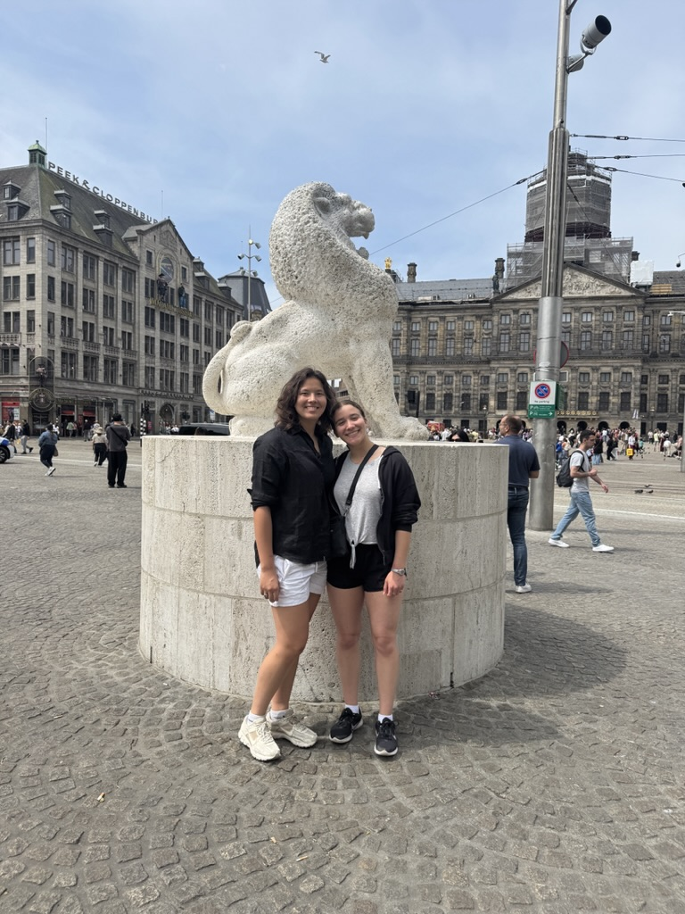

# H1
## H2
### H3

**bold**

*italicize*

> blockquote

`code`

```
def block of code():
    pass
```

1. List item
2. List item
3. list item

- bullet
- bullet

[text to be linked](https://google.com)

# table of contents

[Assignment 1](assignments/assignment1.md)

[go back to heading 1](#H1)



| Column 1 | Column 2 | Column 3 | Column 4 |
|----------|----------|----------|----------|
| Row 1    |          |          |          |
| Row 2    |          |          |          |
| Row 3    |          |          |          |
